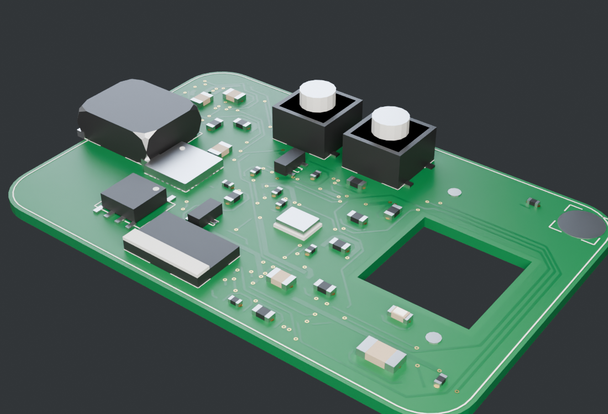

# Blender PCB Generator

Give it a shape. Get back a believable PCB.

A Blender extension that turns a shape you've already decided on into something
that reads as a real circuit board in a render — layered materials, procedural
traces and silkscreen, scattered small components, and precise control over the
parts whose position actually matters.

Library PCB models never fit: wrong outline, wrong size, connectors in the wrong
place. This generates one shaped to what you're building.



*Generated end to end: outline, materials, routing, vias, silkscreen, scattered
passives and placed connectors. Nothing here was modelled by hand.*

## Install

Download or build the extension zip, then in Blender:
**Edit > Preferences > Add-ons > Install from Disk**.

```bash
python3 scripts/build_extension.py     # -> dist/pcb_generator-0.1.0.zip
```

Requires Blender 4.2 LTS or newer. No external dependencies.

The tool lives in the 3D viewport sidebar (`N`) under the **PCB** tab.

## Using it

**1. Get a board.** Three ways, in the Board panel:

- **Add Board** — a rounded rectangle to start from.
- **Extract Outline** — reads a shape off the selected object and builds a board
  from it. Works on curves, flat meshes, and closed solids (tick *Slice Solid*
  to cut a cross-section).
- **Use As Board** — keeps the selected object's own geometry and makes it a PCB
  in place. Your topology, transform and UVs are untouched.

**2. Give it a look.** Soldermask colour, surface finish, gloss.

**3. Place the parts that matter.** *Place Component* is interactive — move the
mouse, `R` rotates, `E` snaps to the board edge, `F` flips side, click to
confirm. Parts can be bound to:

- an **edge**, by position along the outline, so they follow when the shape
  changes;
- a **target object**, inheriting its XY — this is how a tactile switch tracks a
  plastic button cap modelled outside the generator. Move the cap, the switch
  follows.

**4. Populate.** One button scatters filler parts and generates all detail in the
right order — filler first, so routing works around it and terminates on its
pads. Reroll either with a new seed until you like the layout.

**5. Wire it up.** Select the far end, then the board end, and *Add Wire* runs a
sagging wire between them, hooked to both so it follows when either moves.

## How it works

```
shape  →  board  →  materials  →  procedural detail  →  scattered parts  →  placed parts
                                  traces, silkscreen,    seeded filler      ports, buttons —
                                  pads, vias, pour                          exact control
```

Two things are worth knowing about the internals:

**The router is deliberately fake.** There is no netlist and no connectivity.
What the eye reads on a PCB is statistical — density, how runs bundle into
parallel groups, consistent widths, 45-degree corners, vias where traces cross —
so that is what gets reproduced. It routes on two layers with a via cost,
because a single-layer grid router deadlocks: every finished trace is an
unbroken wall that partitions the free space, and the routed fraction collapses
to about 17%. Adding a layer takes it to ~65% and puts vias exactly where they
belong.

**Detail is geometry, not texture.** Traces, pads and silkscreen are flat meshes
sitting microns above the board surface. That gives the slight relief and
gloss shift that makes copper legible under opaque soldermask, and it has no
resolution ceiling in a close-up. Each layer is one mesh, so a thousand traces
is still six objects.

## Layout

```
pcb_generator/
├── core/      pure Python, no bpy — geometry, routing, scatter, anchors
├── build/     turns core's data into meshes and objects
├── parts/     procedural component library (37 parts)
├── shading/   layered board and part materials
├── ops/       operators (thin)
└── ui/        sidebar panels
tests/         74 core tests + a headless end-to-end run
```

`core/` never imports `bpy`. That is what makes most of the logic testable in
seconds without launching Blender.

## Tests

```bash
python3 -m pytest tests/ -q      # core, no Blender needed
python3 tests/smoke_blender.py   # end-to-end, needs `pip install bpy`
python3 tests/render_preview.py  # renders a look check
```

## Scope

**Owns:** board geometry from a given shape, board materials, procedural detail
generation, component scatter, precise component placement, point-to-point wires.

**Does not own:** fabrication output, electrical correctness, netlists, real
routing, EDA interop — or deciding what shape your board should be. You bring
the shape.

See [docs/PLAN.md](docs/PLAN.md) for the design and
[docs/OPEN-QUESTIONS.md](docs/OPEN-QUESTIONS.md) for what is still undecided.
